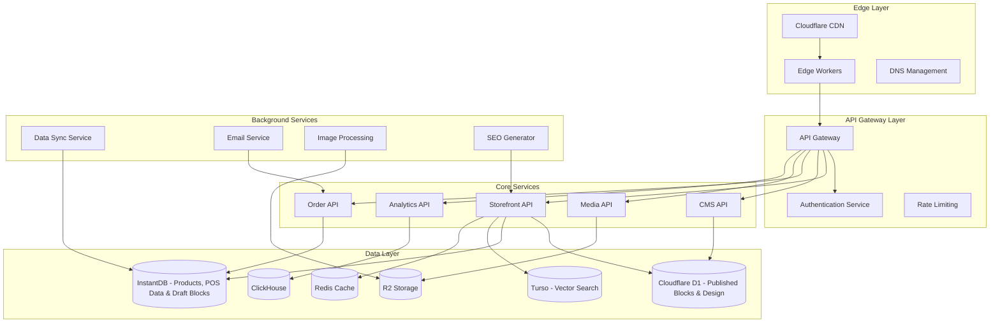
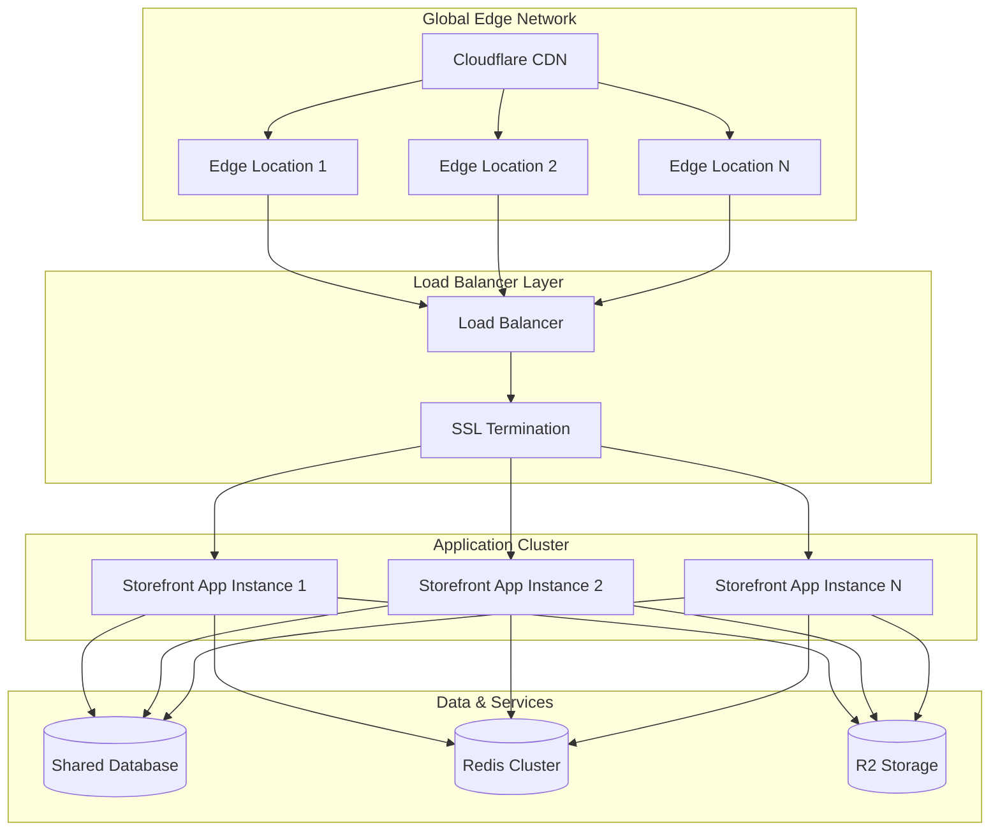
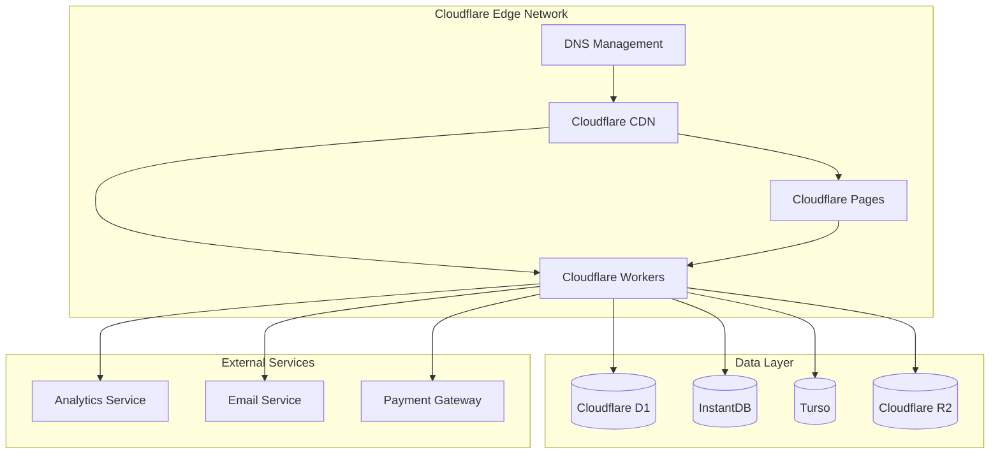
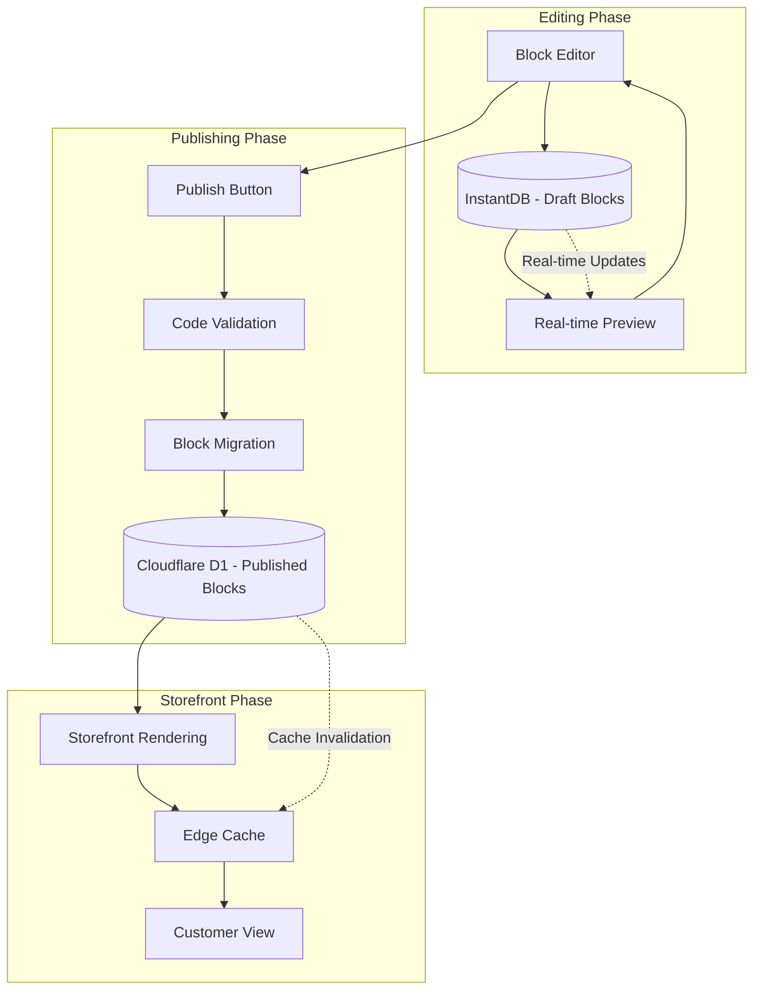

# Design Document

## Overview

The CMS-powered storefront system is a multi-tenant SaaS platform that enables TAR POS users to create and manage e-commerce websites. The system leverages a microservices architecture with edge computing to support millions of users, each with custom domains. The design emphasizes real-time data synchronization, scalable content delivery, and a flexible block-based content management system.

## Frontend Framework Choice

**Selected: SvelteKit on Cloudflare Workers + Pages**
- **Ultra-fast performance**: Minimal JavaScript bundle sizes and optimal runtime performance
- **Server-side rendering**: Perfect for SEO and fast initial loads
- **Cloudflare Workers**: Backend API and dynamic routing at the edge
- **Cloudflare Pages**: Frontend deployment with automatic builds
- **Multi-tenant support**: Dynamic routing based on domain/subdomain
- **Real-time updates**: InstantDB handles all real-time synchronization automatically
- **Developer experience**: Simple, intuitive syntax with excellent TypeScript support
- **Bundle size**: Smallest framework footprint for optimal loading speeds

## Recommended Project Structure

```
📁 tar-pos-system/
├── 📁 apps/
│   ├── 📁 mobile/           # Your existing Expo app (CMS)
│   │   ├── src/
│   │   ├── app.json
│   │   └── package.json
│   │
│   └── 📁 storefront/       # New SvelteKit storefront
│       ├── src/
│       │   ├── routes/      # SvelteKit pages
│       │   ├── lib/         # Services & utilities
│       │   └── app.html
│       ├── workers/         # Cloudflare Workers
│       ├── package.json
│       └── svelte.config.js
│
├── 📁 database/             # Database schemas & migrations
│   ├── d1-schema.sql
│   ├── turso-schema.sql
│   └── migrations/
│
└── package.json             # Root package.json for workspace
```

**Project Structure Benefits:**
- **Clean separation** - Each app is self-contained
- **No shared dependencies** - Each app manages its own packages
- **Simple workspace** - Just for running both apps together
- **Easy deployment** - Each app deploys independently
- **Clear ownership** - Mobile team works in `/mobile`, web team in `/storefront`

## Architecture

### High-Level Architecture



### Multi-Tenant Architecture

The system uses a hybrid multi-tenancy approach:
- **Database Level**: Shared database with tenant isolation through row-level security
- **Application Level**: Tenant context propagated through all services
- **Infrastructure Level**: Shared infrastructure with tenant-specific configurations

### Domain Management Strategy

Each storefront can have:
1. **Default Subdomain**: `{username}.tarpos.store`
2. **Custom Domain**: User-provided domain with automatic SSL
3. **Domain Verification**: DNS verification process for custom domains
4. **SSL Management**: Automatic certificate provisioning via Let's Encrypt

### Storefront Deployment Strategy

**Multi-Tenant Single Application Approach**:
- All storefronts run on a single, horizontally scalable application
- Dynamic routing based on domain/subdomain to identify tenant
- Shared infrastructure with tenant-specific content rendering
- Edge caching for optimal performance across regions

**Deployment Architecture**:


**Cloudflare Workers + Pages Deployment**:


**Request Flow**:
1. Customer visits `customer-store.com` or `username.tarpos.store`
2. DNS resolves to Cloudflare CDN
3. Cloudflare routes to nearest edge location
4. Edge worker identifies tenant from domain
5. Cached content served from edge, or request forwarded to origin
6. Load balancer routes to available application instance
7. Application renders tenant-specific content
8. Response cached at edge for future requests

**Scaling Strategy**:
- **Horizontal Scaling**: Auto-scaling application instances based on load
- **Database Scaling**: Read replicas and connection pooling
- **Cache Scaling**: Redis cluster with automatic failover
- **CDN Scaling**: Global edge network handles traffic spikes
- **Storage Scaling**: Cloudflare R2 provides unlimited scalable storage

## Design Block Publishing Workflow

### Dual-Database Architecture for Design Blocks

The system uses a sophisticated dual-database approach to optimize both editing experience and storefront performance:

**Draft Stage (InstantDB)**:
- All design blocks start as drafts in InstantDB
- Real-time collaboration during editing via InstantDB's built-in real-time features
- Multiple editors can work simultaneously with live updates
- Version control and change tracking
- Instant preview updates without affecting live storefront

**Published Stage (Cloudflare D1)**:
- Final design blocks moved to D1 when published
- Optimized for fast read access at the edge
- Cached globally via Cloudflare's network
- Storefront rendering engine reads from D1 for maximum performance

### Publishing Flow Diagram



### Step-by-Step Publishing Process

1. **Draft Creation**: User creates/edits blocks in the CMS editor
   - Blocks stored in InstantDB as drafts (`isPublished: false`)
   - Real-time updates via InstantDB subscriptions
   - Multiple editors see changes instantly

2. **Real-time Preview**: Changes reflected immediately in preview
   - Preview renders from InstantDB draft blocks
   - No impact on live storefront during editing
   - Collaborative editing with conflict resolution

3. **Validation**: Before publishing, system validates:
   - Vibe code security (no dangerous patterns)
   - Block configuration completeness
   - Dependencies and resource limits
   - HTML output validation

4. **Publishing**: User clicks "Publish" button
   - Draft blocks copied from InstantDB to D1
   - Blocks marked as published in both databases
   - Cache invalidation triggered for affected pages

5. **Storefront Rendering**: Live storefront uses D1 blocks
   - Fast edge-cached reads from D1
   - Optimal performance for customer experience
   - Global CDN distribution

### Data Flow Architecture

```typescript
interface BlockPublishingService {
  // Draft management (InstantDB)
  saveDraft(block: DraftBlock): Promise<void>
  getDrafts(pageId: string): Promise<DraftBlock[]>
  subscribeToChanges(pageId: string, callback: ChangeCallback): Subscription
  
  // Publishing workflow
  validateBlocks(blocks: DraftBlock[]): Promise<ValidationResult>
  publishBlocks(pageId: string): Promise<PublishResult>
  
  // Storefront rendering (D1)
  getPublishedBlocks(pageId: string): Promise<PublishedBlock[]>
  invalidateCache(pageId: string): Promise<void>
}

interface DraftBlock {
  id: string
  pageId: string
  storefrontId: string
  type: string
  vibeCode?: string
  config: Record<string, any>
  position: number
  isPublished: boolean // Always false for drafts
  lastModified: Date
  modifiedBy: string
}

interface PublishedBlock {
  id: string
  pageId: string
  type: string
  vibeCode?: string
  config: Record<string, any>
  position: number
  publishedAt: Date
  publishedBy: string
  version: number
}
```

### Benefits of This Architecture

**For Editors**:
- Real-time collaboration without conflicts
- Instant preview of changes
- Safe editing environment (no impact on live site)
- Version control and rollback capabilities

**For Customers**:
- Ultra-fast storefront loading (D1 + edge cache)
- Consistent experience (no draft content visible)
- Global performance optimization
- High availability and reliability

**For System**:
- Optimal database usage (InstantDB for real-time, D1 for performance)
- Efficient caching strategy
- Scalable architecture
- Clear separation of concerns

## Components and Interfaces

### 1. Storefront Rendering Engine

**Purpose**: Fully dynamic server-side rendering of storefronts with optimal performance

**Key Features**:
- Dynamic rendering for all content from databases
- Real-time block code execution from D1
- Product data fetching from InstantDB
- Vector search capabilities from Turso
- Edge caching for rendered output

**Interface**:
```typescript
interface StorefrontRenderer {
  renderPage(tenantId: string, path: string, context: RenderContext): Promise<RenderedPage>
  generateStaticPages(tenantId: string): Promise<StaticPage[]>
  invalidateCache(tenantId: string, paths: string[]): Promise<void>
}

interface RenderContext {
  user?: User
  cart?: Cart
  device: DeviceInfo
  location?: GeoLocation
}
```

### 2. Block Management System

**Purpose**: Pure code-based block system - NO visual drag-and-drop tools like Webstudio/Webflow

**Block Design Philosophy**:
- **Code-Only Approach**: Users select block type and write vibe code to design it
- **No Visual Editors**: No drag-and-drop, no toolbars, no visual design tools
- **Pure Vibe Code**: All block customization done through JavaScript functions
- **Developer-Focused**: Designed for users who prefer coding over visual tools

**Block Types Available**:
- **Hero Block**: User writes vibe code for hero sections
- **Product Grid Block**: User writes vibe code for product displays  
- **Text Block**: User writes vibe code for content sections
- **Gallery Block**: User writes vibe code for image galleries
- **Custom Block**: User writes completely custom vibe code
- **Blog Block**: User writes vibe code for blog post displays

**Vibe Code System**:
- Users select a block type from a simple list
- Users write JavaScript functions that return HTML strings
- Code is executed in a secure sandbox environment
- Access to storefront data (products, collections, cart) via provided APIs
- Real-time preview shows rendered HTML output
- Version control for block code changes

**Interface**:
```typescript
interface Block {
  id: string
  type: BlockType
  vibeCode?: string // React component code
  config: BlockConfig
  position: number
  visibility: VisibilityRules
  codeVersion: number
  lastCodeUpdate: Date
}

interface VibeCodeBlock extends Block {
  vibeCode: string
  dependencies: string[] // Allowed npm packages
  props: Record<string, any> // Props passed to component
  sandbox: SandboxConfig
}

interface BlockRenderer {
  render(block: Block, context: RenderContext): Promise<string>
  executeVibeCode(code: string, props: any, context: RenderContext): Promise<string>
  validateVibeCode(code: string): CodeValidationResult
  getAvailableAPIs(): APIReference[]
}

interface CodeValidationResult {
  isValid: boolean
  errors: CodeError[]
  warnings: CodeWarning[]
  securityIssues: SecurityIssue[]
}
```
```

### 3. Content Management API

**Purpose**: CRUD operations for all content types

**Endpoints**:
- `/api/cms/pages` - Page management
- `/api/cms/blocks` - Block operations
- `/api/cms/posts` - Blog post management
- `/api/cms/media` - Media library
- `/api/cms/themes` - Theme management

**Interface**:
```typescript
interface CMSService {
  createPage(tenantId: string, page: PageData): Promise<Page>
  updatePage(tenantId: string, pageId: string, updates: Partial<PageData>): Promise<Page>
  publishPage(tenantId: string, pageId: string): Promise<void>
  getPageBlocks(tenantId: string, pageId: string): Promise<Block[]>
  updateBlocks(tenantId: string, pageId: string, blocks: Block[]): Promise<void>
}
```

### 4. Real-time Synchronization Service

**Purpose**: Sync data between POS and storefront systems using InstantDB's real-time capabilities

**Sync Strategy**:
- **InstantDB Real-time Updates**: All real-time synchronization handled by InstantDB's built-in real-time features
- **Draft Design Blocks**: Stored in InstantDB during editing for real-time collaboration
- **Published Design Blocks**: Moved to Cloudflare D1 when published for optimal storefront performance
- **Product/Inventory Sync**: Real-time updates via InstantDB subscriptions
- **Design Block Publishing Flow**: Draft (InstantDB) → Publish → Final (D1) → Storefront Rendering

**Interface**:
```typescript
interface SyncService {
  // Real-time sync via InstantDB subscriptions
  syncProducts(tenantId: string, productIds?: string[]): Promise<SyncResult>
  syncInventory(tenantId: string, locationId?: string): Promise<SyncResult>
  syncOrders(tenantId: string, orderIds?: string[]): Promise<SyncResult>
  
  // Design block publishing workflow
  publishDesignBlocks(tenantId: string, pageId: string): Promise<PublishResult>
  getDraftBlocks(tenantId: string, pageId: string): Promise<Block[]> // From InstantDB
  getPublishedBlocks(tenantId: string, pageId: string): Promise<Block[]> // From D1
  
  // InstantDB real-time subscriptions
  subscribeToProductChanges(tenantId: string, callback: ChangeCallback): Subscription
  subscribeToDesignChanges(tenantId: string, callback: ChangeCallback): Subscription
}

interface PublishResult {
  success: boolean
  publishedBlocks: number
  errors?: PublishError[]
  publishedAt: Date
}
```

### 5. Vibe Code Execution Engine

**Purpose**: Secure execution of user-written JavaScript functions for HTML generation in Cloudflare Workers

**Execution Environment**:
- **Worker-Native Runtime**: Direct JavaScript execution in Cloudflare Workers V8 isolates
- **HTML Template Functions**: Simple functions that return HTML strings
- **Lightweight Templating**: Template literals with data interpolation
- **API Access Control**: Restricted access to storefront data and functions
- **Resource Limits**: CPU time and memory limits enforced by Workers runtime

**Simple Vibe Code Model**:
```typescript
interface VibeCodeSandbox {
  executeCode(code: string, data: any, context: WorkerContext): Promise<string>
  validateCode(code: string): SecurityValidation
  getAllowedAPIs(): APIWhitelist
  getResourceLimits(): ResourceLimits
}

interface WorkerContext {
  storefront: StorefrontData
  products: Product[]
  collections: Collection[]
  cart?: Cart
  user?: User
  device: DeviceInfo
  helpers: TemplateHelpers
}

interface TemplateHelpers {
  formatPrice: (amount: number, currency: string) => string
  formatDate: (date: Date, format: string) => string
  slugify: (text: string) => string
  escapeHtml: (text: string) => string
  generateId: () => string
}

interface APIWhitelist {
  // Simple data access - no complex operations
  getProducts: (filters?: ProductFilters) => Product[]
  getCollections: () => Collection[]
  getCart: () => Cart
  // Utility functions
  formatPrice: (amount: number, currency: string) => string
  formatDate: (date: Date, format: string) => string
}

interface ResourceLimits {
  maxExecutionTime: number // 1 second (Workers limit)
  maxMemoryUsage: number // 128MB (Workers limit)
  maxStringLength: number // 1MB output HTML
}
```

**Vibe Code Examples**:
```javascript
// Simple product grid
function renderProductGrid(products, helpers) {
  return `
    <div class="grid grid-cols-3 gap-4">
      ${products.slice(0, 6).map(product => `
        <div class="border rounded-lg p-4">
          
          <h3>${helpers.escapeHtml(product.name)}</h3>
          <p>${helpers.formatPrice(product.price, 'USD')}</p>
          <button onclick="addToCart('${product.id}', 1)">Add to Cart</button>
        </div>
      `).join('')}
    </div>
  `;
}

// Hero section with dynamic content
function renderHero(storefront, helpers) {
  return `
    <section class="hero bg-gradient-to-r from-blue-500 to-purple-600 text-white py-20">
      <div class="container mx-auto text-center">
        <h1 class="text-4xl font-bold mb-4">${helpers.escapeHtml(storefront.name)}</h1>
        <p class="text-xl mb-8">${helpers.escapeHtml(storefront.tagline)}</p>
        <a href="/products" class="bg-white text-blue-600 px-8 py-3 rounded-lg font-semibold">
          Shop Now
        </a>
      </div>
    </section>
  `;
}
```

**Code Validation**:
- **AST Parsing**: Detect dangerous patterns (eval, Function constructor, etc.)
- **Function Signature**: Ensure function returns string and accepts correct parameters
- **No Imports**: No require/import statements allowed
- **Safe Operations**: Only safe JavaScript operations permitted

### 6. E-commerce Engine

**Purpose**: Handle shopping cart, checkout, and order processing

**Features**:
- Shopping cart management with persistence
- Multi-payment gateway support
- Tax calculation and shipping
- Order fulfillment workflow
- Customer account management

**Interface**:
```typescript
interface EcommerceService {
  addToCart(sessionId: string, item: CartItem): Promise<Cart>
  calculateTotals(cart: Cart, shippingAddress: Address): Promise<OrderTotals>
  processPayment(orderId: string, paymentData: PaymentData): Promise<PaymentResult>
  fulfillOrder(orderId: string, fulfillmentData: FulfillmentData): Promise<Order>
}
```

## Data Models

### Core Entities

```typescript
// Storefront Configuration
interface Storefront {
  id: string
  tenantId: string
  domain: string
  customDomain?: string
  theme: ThemeConfig
  settings: StorefrontSettings
  status: 'active' | 'inactive' | 'suspended'
  createdAt: Date
  updatedAt: Date
}

// Page Structure
interface Page {
  id: string
  storefrontId: string
  slug: string
  title: string
  metaDescription?: string
  blocks: Block[]
  isPublished: boolean
  publishedAt?: Date
  seoConfig: SEOConfig
}

// Content Block with Vibe Code Support
interface Block {
  id: string
  type: BlockType
  vibeCode?: string // React component code
  config: Record<string, any>
  position: number
  visibility: {
    devices: ('desktop' | 'tablet' | 'mobile')[]
    userTypes: ('guest' | 'customer')[]
    dateRange?: { start: Date; end: Date }
  }
  codeVersion: number
  lastCodeUpdate: Date
  dependencies: string[] // Allowed npm packages
}

// Product Extension for Storefront
interface StorefrontProduct extends Product {
  seoTitle?: string
  seoDescription?: string
  featuredImage?: string
  gallery: string[]
  relatedProducts: string[]
  customFields: Record<string, any>
}

// Order with Storefront Context
interface StorefrontOrder extends Order {
  storefrontId: string
  customerNotes?: string
  shippingMethod: ShippingMethod
  trackingNumber?: string
  fulfillmentStatus: FulfillmentStatus
}
```

### Multi-Database Schema Architecture

**Cloudflare D1 Schema (Blocks & Design)**:
```sql
-- Storefronts configuration
CREATE TABLE storefronts (
  id TEXT PRIMARY KEY,
  tenant_id TEXT NOT NULL,
  domain TEXT UNIQUE NOT NULL,
  custom_domain TEXT UNIQUE,
  theme_config TEXT NOT NULL DEFAULT '{}', -- JSON string
  settings TEXT NOT NULL DEFAULT '{}', -- JSON string
  status TEXT NOT NULL DEFAULT 'active',
  created_at INTEGER NOT NULL DEFAULT (unixepoch()),
  updated_at INTEGER NOT NULL DEFAULT (unixepoch())
);

-- Pages structure
CREATE TABLE pages (
  id TEXT PRIMARY KEY,
  storefront_id TEXT NOT NULL,
  slug TEXT NOT NULL,
  title TEXT NOT NULL,
  meta_description TEXT,
  is_published INTEGER DEFAULT 0, -- SQLite boolean
  published_at INTEGER,
  seo_config TEXT NOT NULL DEFAULT '{}', -- JSON string
  created_at INTEGER NOT NULL DEFAULT (unixepoch()),
  updated_at INTEGER NOT NULL DEFAULT (unixepoch()),
  FOREIGN KEY (storefront_id) REFERENCES storefronts(id),
  UNIQUE(storefront_id, slug)
);

-- Blocks with vibe code
CREATE TABLE blocks (
  id TEXT PRIMARY KEY,
  page_id TEXT NOT NULL,
  type TEXT NOT NULL,
  vibe_code TEXT, -- JavaScript function code
  config TEXT NOT NULL DEFAULT '{}', -- JSON string
  position INTEGER NOT NULL DEFAULT 0,
  visibility TEXT NOT NULL DEFAULT '{"devices": ["desktop", "tablet", "mobile"], "userTypes": ["guest", "customer"]}',
  code_version INTEGER DEFAULT 1,
  last_code_update INTEGER DEFAULT (unixepoch()),
  dependencies TEXT DEFAULT '[]', -- JSON array of allowed packages
  created_at INTEGER NOT NULL DEFAULT (unixepoch()),
  updated_at INTEGER NOT NULL DEFAULT (unixepoch()),
  FOREIGN KEY (page_id) REFERENCES pages(id) ON DELETE CASCADE
);

-- Blog posts
CREATE TABLE posts (
  id TEXT PRIMARY KEY,
  storefront_id TEXT NOT NULL,
  title TEXT NOT NULL,
  slug TEXT NOT NULL,
  content TEXT NOT NULL,
  excerpt TEXT,
  featured_image TEXT,
  author_id TEXT,
  status TEXT DEFAULT 'draft',
  published_at INTEGER,
  seo_config TEXT NOT NULL DEFAULT '{}',
  created_at INTEGER NOT NULL DEFAULT (unixepoch()),
  updated_at INTEGER NOT NULL DEFAULT (unixepoch()),
  FOREIGN KEY (storefront_id) REFERENCES storefronts(id),
  UNIQUE(storefront_id, slug)
);

-- Indexes for performance
CREATE INDEX idx_storefronts_tenant ON storefronts(tenant_id);
CREATE INDEX idx_storefronts_domain ON storefronts(domain);
CREATE INDEX idx_pages_storefront ON pages(storefront_id);
CREATE INDEX idx_blocks_page ON blocks(page_id);
CREATE INDEX idx_blocks_position ON blocks(page_id, position);
CREATE INDEX idx_posts_storefront ON posts(storefront_id);
CREATE INDEX idx_posts_status ON posts(storefront_id, status);
```

**InstantDB Schema (Products, POS Data & Draft Blocks)**:
```typescript
// Existing InstantDB schema remains unchanged for POS data
// Products, orders, inventory, customers continue to live in InstantDB
// PLUS: Draft design blocks during editing phase

// Draft blocks table in InstantDB (for real-time collaboration)
interface DraftBlock {
  id: string
  pageId: string
  storefrontId: string
  type: string
  vibeCode?: string
  config: Record<string, any>
  position: number
  visibility: VisibilityRules
  codeVersion: number
  lastCodeUpdate: Date
  isPublished: boolean // false for drafts
  createdAt: Date
  updatedAt: Date
}

// Storefront system reads from InstantDB for:
// - Product catalog (real-time updates)
// - Inventory levels (real-time updates)
// - Order processing (real-time updates)
// - Customer data (real-time updates)
// - POS integration (real-time updates)
// - Draft design blocks (real-time collaboration during editing)
```

**Turso Schema (Vector Search)**:
```sql
-- Product embeddings for search
CREATE TABLE product_embeddings (
  id TEXT PRIMARY KEY,
  product_id TEXT NOT NULL,
  storefront_id TEXT NOT NULL,
  embedding BLOB NOT NULL, -- Vector embedding
  content TEXT NOT NULL, -- Searchable content
  metadata TEXT NOT NULL DEFAULT '{}', -- JSON metadata
  created_at INTEGER NOT NULL DEFAULT (unixepoch()),
  updated_at INTEGER NOT NULL DEFAULT (unixepoch())
);

-- Content embeddings for semantic search
CREATE TABLE content_embeddings (
  id TEXT PRIMARY KEY,
  content_type TEXT NOT NULL, -- 'product', 'post', 'page'
  content_id TEXT NOT NULL,
  storefront_id TEXT NOT NULL,
  embedding BLOB NOT NULL,
  content TEXT NOT NULL,
  metadata TEXT NOT NULL DEFAULT '{}',
  created_at INTEGER NOT NULL DEFAULT (unixepoch()),
  updated_at INTEGER NOT NULL DEFAULT (unixepoch())
);

-- Vector similarity search indexes
CREATE INDEX idx_product_embeddings_storefront ON product_embeddings(storefront_id);
CREATE INDEX idx_content_embeddings_storefront ON content_embeddings(storefront_id);
CREATE INDEX idx_content_embeddings_type ON content_embeddings(content_type, storefront_id);
```

## Error Handling

### Error Categories

1. **Validation Errors**: Invalid input data, configuration errors
2. **Authentication Errors**: Unauthorized access, expired tokens
3. **Resource Errors**: Not found, already exists, quota exceeded
4. **System Errors**: Database failures, external service errors
5. **Rate Limiting**: Too many requests, quota exceeded

### Error Response Format

```typescript
interface ErrorResponse {
  error: {
    code: string
    message: string
    details?: Record<string, any>
    timestamp: string
    requestId: string
  }
}
```

### Resilience Patterns

- **Circuit Breaker**: Prevent cascading failures
- **Retry Logic**: Exponential backoff for transient failures
- **Graceful Degradation**: Fallback to cached content
- **Health Checks**: Monitor service availability
- **Timeout Management**: Prevent hanging requests

## Product Mockups and User Interface Design

### Customer-Facing Storefront Examples

#### Homepage Layout
```
🌐 mystore.com (or username.tarpos.store)

┌─────────────────────────────────────────────────────┐
│ [Logo] MyStore                    🛒 Cart (2) Login │
├─────────────────────────────────────────────────────┤
│                                                     │
│        🎨 HERO BLOCK (Vibe Code)                   │
│    Welcome to Our Amazing Store                     │
│    [Shop Now Button]                               │
│                                                     │
├─────────────────────────────────────────────────────┤
│                                                     │
│    📦 FEATURED PRODUCTS (Dynamic from InstantDB)   │
│    ┌─────┐ ┌─────┐ ┌─────┐ ┌─────┐                │
│    │ 📱  │ │ 👕  │ │ 👟  │ │ 🎧  │                │
│    │$299 │ │$49  │ │$89  │ │$199 │                │
│    └─────┘ └─────┘ └─────┘ └─────┘                │
│                                                     │
├─────────────────────────────────────────────────────┤
│    📝 BLOG POSTS (From D1)                        │
│    • "How to Style Your Look"                      │
│    • "New Arrivals This Week"                      │
│                                                     │
└─────────────────────────────────────────────────────┘
```

#### Product Page Layout
```
🌐 mystore.com/products/smartphone

┌─────────────────────────────────────────────────────┐
│ [Logo] MyStore                    🛒 Cart (2) Login │
├─────────────────────────────────────────────────────┤
│                                                     │
│  📱 [Product Images]    📋 iPhone 15 Pro           │
│  ┌─────────────────┐    💰 $999.99                 │
│  │                 │    📦 In Stock (15 units)     │
│  │   Main Image    │                               │
│  │                 │    🎨 CUSTOM BLOCK (Vibe Code)│
│  └─────────────────┘    "Why customers love this"  │
│  [🖼️][🖼️][🖼️][🖼️]                                │
│                         🛒 [Add to Cart]           │
│                         ❤️ [Add to Wishlist]       │
│                                                     │
├─────────────────────────────────────────────────────┤
│    📝 Product Description (Rich Text from D1)      │
│    🔍 Related Products (AI-powered from Turso)     │
│                                                     │
└─────────────────────────────────────────────────────┘
```

### Admin CMS Interface (Expo App Integration)

#### Storefront Management Screen
```
TAR POS - Storefront Manager

┌─────────────────────────────────────────────────────┐
│ ← Back                              🌐 My Storefront │
├─────────────────────────────────────────────────────┤
│                                                     │
│ 🏪 Store Settings                                   │
│ ┌─────────────────────────────────────────────────┐ │
│ │ Store Name: [Amazing Electronics Store        ] │ │
│ │ Domain: [mystore.tarpos.store                 ] │ │
│ │ Custom Domain: [www.mystore.com               ] │ │
│ │ Status: 🟢 Active                              │ │
│ └─────────────────────────────────────────────────┘ │
│                                                     │
│ 🎨 Page Builder                                     │
│ ┌─────────────────────────────────────────────────┐ │
│ │ Homepage                          [Edit] [View] │ │
│ │ Products Page                     [Edit] [View] │ │
│ │ About Us                          [Edit] [View] │ │
│ │ + Add New Page                                  │ │
│ └─────────────────────────────────────────────────┘ │
│                                                     │
│ 📊 Analytics                                        │
│ ┌─────────────────────────────────────────────────┐ │
│ │ 👥 Visitors Today: 245                          │ │
│ │ 🛒 Orders Today: 12                             │ │
│ │ 💰 Revenue Today: $2,450                        │ │
│ └─────────────────────────────────────────────────┘ │
│                                                     │
└─────────────────────────────────────────────────────┘
```

#### Block Editor Interface (Pure Vibe Code - No Visual Tools)
```
TAR POS - Vibe Code Block Editor

┌─────────────────────────────────────────────────────┐
│ ← Back to Pages                    Homepage Editor   │
├─────────────────────────────────────────────────────┤
│                                                     │
│ 📱 Live Preview                     📝 Block Types  │
│ ┌─────────────────────────┐        ┌─────────────┐  │
│ │ [Hero Section]          │        │ □ Hero      │  │
│ │ Welcome to My Store     │        │ □ Products  │  │
│ │ [Shop Now]              │        │ □ Text      │  │
│ ├─────────────────────────┤        │ □ Gallery   │  │
│ │ [Product Grid]          │        │ □ Blog      │  │
│ │ [📱] [👕] [👟] [🎧]    │        │ □ Custom    │  │
│ ├─────────────────────────┤        └─────────────┘  │
│ │ [Custom Vibe Block]     │                         │
│ │ "Special Offers"        │        🔧 Selected Block│
│ └─────────────────────────┘        ┌─────────────┐  │
│                                    │ Type: Hero  │  │
│ 💻 Vibe Code Editor (Full Screen)  │ Position: 1 │  │
│ ┌─────────────────────────────────┐ │ [Delete]    │  │
│ │ function renderHero(storefront, │ │ [Duplicate] │  │
│ │   products, helpers) {          │ └─────────────┘  │
│ │   return `                      │                  │
│ │     <section class="hero        │ 💾 Actions      │
│ │       bg-blue-600 text-white    │ ┌─────────────┐  │
│ │       py-20">                   │ │ [Save Draft]│  │
│ │       <div class="container     │ │ [Preview]   │  │
│ │         mx-auto text-center">   │ │ [Publish]   │  │
│ │         <h1 class="text-4xl     │ └─────────────┘  │
│ │           font-bold mb-4">      │                  │
│ │           ${helpers.escapeHtml( │                  │
│ │             storefront.name)}   │                  │
│ │         </h1>                   │                  │
│ │         <a href="/products"     │                  │
│ │           class="bg-white       │                  │
│ │           text-blue-600 px-8    │                  │
│ │           py-3 rounded-lg">     │                  │
│ │           Shop Now              │                  │
│ │         </a>                    │                  │
│ │       </div>                    │                  │
│ │     </section>                  │                  │
│ │   `;                            │                  │
│ │ }                               │                  │
│ └─────────────────────────────────┘                  │
│                                                     │
└─────────────────────────────────────────────────────┘
```

### Key Features Demonstrated

**Customer Experience Features:**
- ⚡ **Ultra-fast loading** (SvelteKit + Cloudflare edge)
- 📱 **Fully responsive** design for all devices
- 🛒 **Shopping cart** with real-time inventory updates
- 🔍 **Smart search** powered by vector embeddings (Turso)
- 💳 **Secure checkout** with multiple payment options
- 🎨 **Custom blocks** created with vibe code system

**Store Owner Experience Features:**
- 🎨 **Visual block editor** with drag-and-drop functionality
- 💻 **Vibe code system** for unlimited customization
- 📊 **Real-time analytics** dashboard integration
- 🌐 **Custom domain** mapping with SSL certificates
- 📱 **Mobile CMS** management through Expo app
- 🔄 **Live preview** of storefront changes

**Technical Architecture Features:**
- 🚀 **Multi-tenant** architecture supporting millions of stores
- 🔄 **Real-time synchronization** between POS and storefront
- 🗄️ **Multi-database** system (D1, InstantDB, Turso)
- 🌍 **Global CDN** for fast content delivery worldwide
- 🔒 **Enterprise security** with tenant isolation

## Testing Strategy

### Testing Pyramid

1. **Unit Tests**: Individual component testing
   - Block rendering logic
   - Data transformation functions
   - Validation rules
   - Business logic services

2. **Integration Tests**: Service interaction testing
   - API endpoint testing
   - Database operations
   - External service integration
   - Real-time sync functionality

3. **End-to-End Tests**: Complete user journey testing
   - Storefront creation workflow
   - Content management operations
   - Customer shopping experience
   - Order processing flow

4. **Performance Tests**: Scalability and load testing
   - Concurrent user simulation
   - Database performance under load
   - CDN cache effectiveness
   - API response times

### Test Data Management

- **Tenant Isolation**: Separate test data per tenant
- **Seed Data**: Consistent test datasets
- **Data Cleanup**: Automated cleanup after tests
- **Mock Services**: External service mocking

### Monitoring and Observability

- **Application Metrics**: Response times, error rates, throughput
- **Business Metrics**: Storefront creation rate, order conversion
- **Infrastructure Metrics**: CPU, memory, database performance
- **User Experience Metrics**: Page load times, bounce rates
- **Real-time Dashboards**: Grafana dashboards for monitoring
- **Alerting**: PagerDuty integration for critical issues